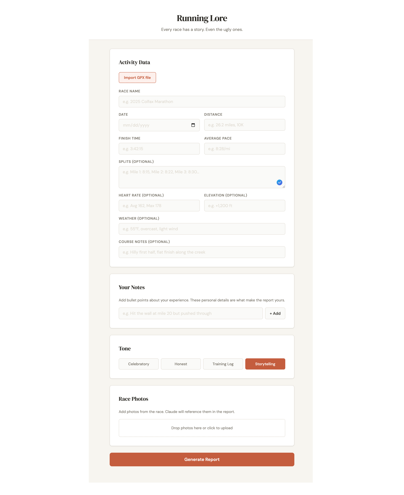
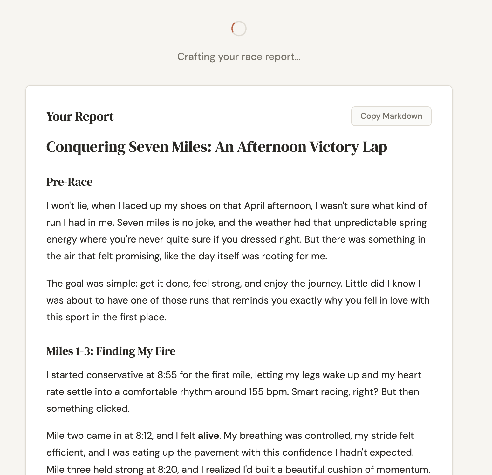

# Running Lore

Every race has a story. Even the ugly ones.

Turn your race data and personal notes into a blog-ready race report, powered by Claude.





## Features

- **GPX import** -- drop a `.gpx` file and the form auto-fills race name, date, distance, time, pace, splits, heart rate, and elevation
- **Race photos** -- upload up to 5 photos (JPEG, PNG, WebP, GIF); Claude sees them and weaves them into the report
- **Four tones** -- Celebratory, Honest, Training Log, or Storytelling
- **Streaming output** -- report text streams in as Claude writes it, no waiting for the full response
- **Copy markdown** -- one click copies the full markdown, ready to paste into any blog

## Project Structure

```
running-lore/
  packages/
    shared/    # TypeScript types shared between server and client
    server/    # Express API with Anthropic SDK
    client/    # React + Vite frontend
```

## Quick Start

```bash
# Install all dependencies
npm install

# Build shared types (needed first)
npm run build -w packages/shared

# Set up your API key
cp .env.example .env
# Edit .env and add your Anthropic API key

# Run both server and client in dev mode
npm run dev
```

The client runs at `http://localhost:5173` with an API proxy to the server at `http://localhost:3001`.

## How It Works

1. **Fill in your race data** manually, or drop a GPX file to auto-populate everything
2. **Add personal notes** as bullet points -- the details that make the report yours
3. **Upload race photos** (optional) -- Claude will reference what it sees in the narrative
4. **Pick a tone** and hit Generate
5. **Copy the markdown** and paste it into WordPress, Ghost, or anywhere else

## Tech Stack

- **Monorepo:** npm workspaces
- **Shared:** TypeScript interfaces and constants
- **Server:** Express, TypeScript, Zod validation, Anthropic SDK (Claude Sonnet), streaming responses
- **Client:** React 19, TypeScript, Vite, react-markdown, GPX parsing via DOMParser

## Security

- Helmet security headers
- Rate limited to 10 requests/minute per IP on the generate endpoint
- All text inputs sanitized (HTML tags stripped via Zod transforms)
- Images validated by media type and capped at 5 per request
- Request body limit of 20 MB
- Startup fails fast if `ANTHROPIC_API_KEY` is missing

## API

`POST /api/report/generate` -- returns a streaming plain-text response (markdown)

```json
{
  "activity": {
    "raceName": "2025 Colfax Marathon",
    "date": "2025-05-18",
    "distance": "26.2 miles",
    "finishTime": "3:42:15",
    "averagePace": "8:28/mi",
    "splits": "Mile 1: 8:15, Mile 2: 8:22...",
    "heartRate": "Avg 162, Max 178",
    "elevation": "+1,200 ft",
    "weather": "55°F, overcast",
    "course": "Hilly first half, flat finish"
  },
  "notes": [
    "Went out too fast on mile 3",
    "Cramp at mile 18 but worked through it",
    "New PR by 4 minutes"
  ],
  "tone": "storytelling",
  "images": [
    { "data": "<base64>", "mediaType": "image/jpeg" }
  ]
}
```

## Tests

```bash
npm test
```

49 tests across 7 files using [Vitest](https://vitest.dev/) and [@testing-library/react](https://testing-library.com/).

### Server

**`validation.test.ts`** -- Zod schema coverage
- Accepts valid activity with required fields only (optional fields default to `''`)
- Accepts valid activity with all optional fields populated
- Rejects missing or empty required fields (`raceName`, `date`, `distance`, `finishTime`, `averagePace`)
- Accepts all four tone values; rejects unknown tones
- Accepts notes array; applies default empty array when omitted
- Rejects missing or malformed activity objects

**`reportGenerator.test.ts`** -- Prompt building and response parsing
- `buildPrompt()` includes all required activity fields in the output
- `buildPrompt()` omits optional fields when not provided, includes them when present
- `buildPrompt()` formats notes as bullet points with the correct header
- `buildPrompt()` injects the correct tone guide for each of the four tones
- `parseResponse()` extracts the title from the H1 heading and strips it from the body
- `parseResponse()` defaults title to `"Race Report"` when no H1 is found
- `parseResponse()` does not treat `##` subheadings as the title

### Client

**`useReport.test.ts`** -- Fetch hook behaviour
- Starts with `result: null`, `error: null`, `loading: false`
- Sets `loading: true` while the request is in flight, `false` when done
- Sets `result` on a successful 2xx response
- Sets `error` from the response body on a non-2xx response
- Sets `error` on a network failure
- POSTs to `/api/report/generate` with `Content-Type: application/json`
- Clears previous result and error at the start of each new generation

**`ActivityForm.test.tsx`** -- Race data form
- Renders all 10 input fields (required and optional)
- Displays current activity values passed via props
- Calls `onChange` with the updated activity object on field input

**`NotesEditor.test.tsx`** -- Bullet-point notes
- Renders the text input and Add button
- Displays existing notes passed via props
- Adds a note on button click or Enter key
- Ignores clicks/Enter when the input is empty
- Removes a note by index when the remove button is clicked

**`ToneSelector.test.tsx`** -- Tone picker
- Renders all four tone options
- Applies `active` class to the currently selected tone only
- Calls `onChange` with the correct tone value on click

**`ReportOutput.test.tsx`** -- Report display
- Renders the report title
- Renders markdown body content (headers, bold, paragraphs)
- Shows a Copy Markdown button
- Clicking Copy writes the full markdown (with H1 prepended) to the clipboard and shows "Copied!"

## Next Steps

- [ ] Strava OAuth integration (auto-pull activity data)
- [ ] SQLite/Postgres for race history
- [ ] Style training from past blog posts
- [ ] WordPress publishing integration
- [ ] Weather API enrichment by date/location
- [ ] User accounts and subscription billing
